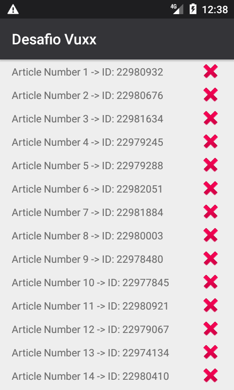

# DESAFIO TÉCNICO VUXX

## Descrição Geral

Desafio tecnico da empresa Vuxx.



## Descrição técnica

### Resumo
Utilizei a arquitetura MVVM, com o uso de Interactors como ponte entre ViewModels (VM) e Repositório (`AppRepository`).
O `AppRepository` representa a abstração do fornecimnto dos dados que serão utilizados pela aplicação. Ele detem a política de decisão sobre como obter o dado. Parte dessa política está delegada ao `NetworkBoundResource`.
Os `Interactors` aplicam regras de negócio transformando os dados que serão utilizados pela `ViewModel`. Os `Interactors` estão padronizados (via `BaseInteractors`) para utilizarem, quando necessário, dos `Coroutines` para realização de suas tarefas assíncronas, como obter e transformar dados.

### Principais BiBliotecas

- **Retrofit 2**: Para consultas http;

- **Hawk**: Para persistência simples de dados (criptografado e não relacional)

- **Coroutines**: Para assincronicidade com melhor leitura de código (sem callbacks)

- **Android Architecture Components**: Utilização de Viewmodel e Livedata
  para exibir e manter os dados utilizados pela View de maneira segura
  com o ciclo de vida das Activities


## Testes

Os testes utilizam o buildtype ```instrumentation``` para rodar, pois forçamos que o app seja buildado para apontar para localhost durante os testes.
